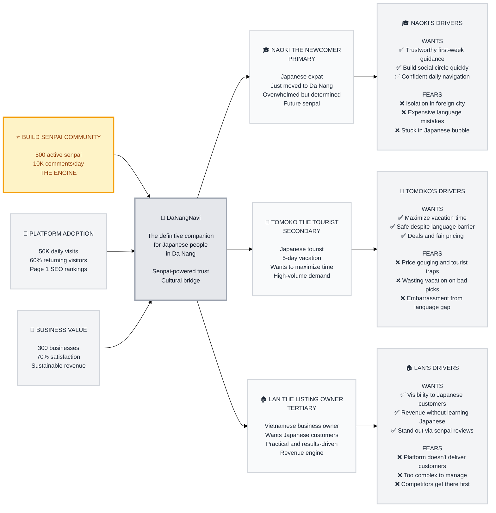

# Trigger Map Poster: DaNangNavi

> Visual overview connecting business goals to user psychology

**Created:** 2026-04-07
**Author:** Lem + Saga (AI Strategic Analyst)
**Methodology:** Based on Effect Mapping (Balic & Domingues), adapted for WDS framework

---

## Strategic Documents

This is the visual overview. For detailed documentation, see:

- **[01-Business-Goals.md](01-Business-Goals.md)** - Full vision statements and SMART objectives
- **[02-Naoki-the-Newcomer.md](02-Naoki-the-Newcomer.md)** - Primary persona (Japanese newcomer/expat)
- **[03-Tomoko-the-Tourist.md](03-Tomoko-the-Tourist.md)** - Secondary persona (Japanese tourist)
- **[04-Lan-the-Listing-Owner.md](04-Lan-the-Listing-Owner.md)** - Tertiary persona (Vietnamese business owner)
- **[05-Key-Insights.md](05-Key-Insights.md)** - Strategic implications and design focus

---

## Vision

**DaNangNavi becomes the definitive companion platform for Japanese people in Da Nang — where every newcomer, tourist, and long-term resident finds trustworthy, actionable guidance powered by a thriving senpai community that grows stronger with every person it helps.**

---

## The Transformation

**BEFORE:** Japanese people in Da Nang rely on scattered TikTok videos, outdated blogs, and word-of-mouth — feeling isolated, anxious, and unable to convert inspiration into action.

**AFTER:** A thriving senpai community on DaNangNavi makes every Japanese person feel confident, connected, and at home in Da Nang — turning newcomers into residents, tourists into return visitors, and local businesses into cross-cultural bridges.

---

## The Flywheel (3 Tiers)

**⭐ THE ENGINE (Priority #1): 500 Active Senpai**
- Newcomers arrive → DaNangNavi helps them settle → they become senpai
- Senpai create authentic content → attracts more users → some become senpai
- Self-sustaining loop that no competitor can replicate

**🚀 PLATFORM ADOPTION (Priority #2): 50K Daily Visits**
- Senpai content drives SEO rankings → organic discovery
- Quality recommendations drive returning visitors (60%+)
- Active community drives engagement (10K comments/day)

**🌟 BUSINESS VALUE (Priority #3): 300 Businesses**
- User traffic proves value to Vietnamese business owners
- Coupon redemptions create measurable ROI
- Revenue enables platform sustainability and growth

---

## Business Strategy

**Key Points:**
- B2B2C model: free for Japanese users, revenue from Vietnamese businesses
- Phase 1 (Launch): completely free for both sides — build user base & content
- Phase 2 (Monetize): ads, promoted listings, booking fees, coupon commissions
- Competitive moat: senpai community network effect — can't be bought, only built
- Solo developer, 7-day demo deadline: 10 UI screens, Next.js + mock data

---

## Business Objectives

### Objective 1: Thriving Senpai Community (THE ENGINE)
- **Metric:** Active senpai contributors
- **Target:** 500 active senpai
- **Timeline:** 6 months

### Objective 2: Daily User Traffic
- **Metric:** Unique daily visits
- **Target:** 50,000/day
- **Timeline:** 6 months

### Objective 3: User Retention
- **Metric:** Returning visitor rate
- **Target:** 60%+
- **Timeline:** 4 months

### Objective 4: Community Engagement
- **Metric:** Daily comments
- **Target:** 10,000/day
- **Timeline:** 6 months

### Objective 5: Search Visibility
- **Metric:** Google ranking for top JP keywords
- **Target:** Page 1
- **Timeline:** 6 months

### Objective 6: Business Onboarding
- **Metric:** Registered businesses
- **Target:** 300
- **Timeline:** 6 months

### Objective 7: Business Satisfaction
- **Metric:** Owner satisfaction rate
- **Target:** 70%+
- **Timeline:** 6 months

---

## Target Groups (Prioritized)

### 1. Naoki the Newcomer — PRIMARY 🎓

**Priority Reasoning:** Naoki IS the flywheel engine. His journey from overwhelmed newcomer to confident senpai creates the content, community, and trust that powers everything else.

> Japanese professional who just moved to Da Nang. Overwhelmed by daily tasks, isolated by language barrier, but determined to build a real life here — not just survive. Systematic thinker who, once settled, naturally shares what he learned with others. His transformation from confused foreigner to confident resident IS the DaNangNavi story.

**Key Positive Drivers:**
- Find trustworthy step-by-step guidance for first-week essentials from senpai who've been through it
- Build a social circle with Japanese expats to combat isolation and create belonging
- Feel confident navigating daily life without relying on Vietnamese language skills

**Key Negative Drivers:**
- Fear being isolated and overwhelmed in a city where nobody speaks Japanese
- Fear making expensive mistakes on housing, contracts, or services due to language barriers
- Fear staying in a "Japanese bubble" and missing authentic Da Nang experiences

---

### 2. Tomoko the Tourist — SECONDARY 💼

**Priority Reasoning:** Tomoko represents high-volume traffic that proves platform value to businesses. Her coupon redemptions and spending create measurable ROI that convinces Lan to invest.

> Japanese tourist visiting Da Nang for 5 days. Did homework on TikTok but can't convert inspiration into action. Every wasted hour is irreplaceable. Risk-averse but curious. Wants verified recommendations, transparent pricing, and communication support — then she'll spend generously and tell all her friends.

**Key Positive Drivers:**
- Maximize limited vacation time with efficient discovery of verified, quality experiences
- Feel safe and confident despite language barrier through real-time communication tools
- Find exclusive deals and transparent pricing to avoid tourist markups

**Key Negative Drivers:**
- Fear being cheated on prices or led to tourist traps
- Fear wasting precious vacation days on bad recommendations
- Fear embarrassment or helplessness when language barrier creates friction

---

### 3. Lan the Listing Owner — TERTIARY 🏠

**Priority Reasoning:** Lan represents the revenue model. Her willingness to pay for promoted listings validates the B2B2C business model and funds platform sustainability.

> Vietnamese restaurant owner who sees Japanese tourists walk past daily but can't reach them. Pragmatic, resource-conscious, needs to see proof before investing. Excellent at her craft but has zero ability to market in Japanese. Wants a platform that bridges the language/cultural gap so she can focus on cooking.

**Key Positive Drivers:**
- Gain direct visibility to Japanese customers who are actively searching for her business type
- Increase bookings without needing to understand Japanese language or cultural marketing
- Stand out from competitors through verified senpai reviews and promoted placement

**Key Negative Drivers:**
- Fear investing money in a platform that doesn't deliver countable customers
- Fear complexity of managing an online presence in a language she doesn't understand
- Fear losing Japanese customers to competitors who get on the platform first

---

## Trigger Map Visualization

---

## How to Read This Map

**Left to Right Flow:**
1. **Business Goals** (left) — what the business needs to achieve
2. **Platform** (center) — what we're building to achieve those goals
3. **Target Groups** (middle-right) — who we need to serve, prioritized
4. **Driving Forces** (right) — WHY they act, both desires (✅) and fears (❌)

**Priority System:**
- ⭐ **PRIMARY GOAL** (gold) — THE ENGINE. Everything depends on this
- 🚀 **SECONDARY** — driven by the primary goal succeeding
- 🌟 **TERTIARY** — benefits that emerge from platform success

**Design Decisions Flow FROM Driving Forces:**
- Every feature should address a specific driving force
- Features addressing PRIMARY persona (Naoki) get highest priority
- Negative drivers (fears) often inspire the most impactful design decisions

---

## Design Focus Statement

**The DaNangNavi platform transforms isolated Japanese newcomers and anxious tourists into confident, connected members of a thriving Da Nang community — powered by senpai wisdom, not algorithms — functioning as a trusted cultural bridge, not a commercial directory.**

**Primary Design Target:** Naoki the Newcomer

**Must Address:**
- Naoki's fear of isolation → immediate community connection
- Naoki's fear of costly mistakes → price transparency and senpai verification
- Naoki's language barrier → voice translation and bilingual tools everywhere
- Naoki's need for guidance → onboarding flow with senpai-authored checklists
- Naoki's need for belonging → active community with events and groups

**Should Address:**
- Tomoko's need for instant results → location-aware curated recommendations
- Tomoko's need for deals → prominent coupon system with clear savings
- Lan's need for proof → analytics dashboard showing real customer numbers
- New user learning curve → intuitive Japanese UX, zero tutorial required
- Cross-cultural understanding → cultural bridge content serving both sides

---

## Cross-Group Patterns

### Shared Drivers

**Language barrier** is the #1 driver across ALL groups:
- Naoki: can't navigate daily life
- Tomoko: can't order food or negotiate prices
- Lan: can't market to Japanese customers

**Trust deficit** is the #2 shared driver:
- Naoki: doesn't know which information to trust
- Tomoko: doesn't know which businesses to trust
- Lan: doesn't know which platform to trust

**Implication:** Translation tools and trust signals (senpai reviews, verification badges, price transparency) are the platform's foundation, not features.

### Unique Drivers

- **Naoki uniquely** needs long-term community and identity transformation (newcomer → resident → senpai)
- **Tomoko uniquely** needs time-optimized discovery (5-day constraint creates urgency)
- **Lan uniquely** needs business ROI proof (she's the one paying, so she needs measurable results)

### Potential Tensions

- **Content depth vs. speed**: Naoki wants detailed guides; Tomoko wants quick answers. Solution: layered content with summary + deep dive
- **Free vs. monetized**: Users expect free forever; businesses need to see ROI. Solution: free basic, paid premium — value proven before asking for money
- **Japanese-first vs. Vietnamese dashboard**: Two separate experiences needed. Solution: distinct UX tracks sharing the same data layer

---

## Next Steps

This Trigger Map Poster provides a quick reference. For detailed work:

- [ ] **Review detailed docs** - See persona documents for full driving forces
- [ ] **Use for Feature Prioritization** - Reference driving forces when making feature decisions
- [ ] **Guide UX Design** - Ensure designs address priority drivers for Naoki first
- [ ] **Validate with Users** - Test assumptions with real Japanese expats and tourists
- [ ] **Update as Learnings Emerge** - This is a living document

---

_Generated with Whiteport Design Studio framework_
_Trigger Mapping methodology credits: Effect Mapping by Mijo Balic & Ingrid Domingues (inUse), adapted with negative driving forces_
