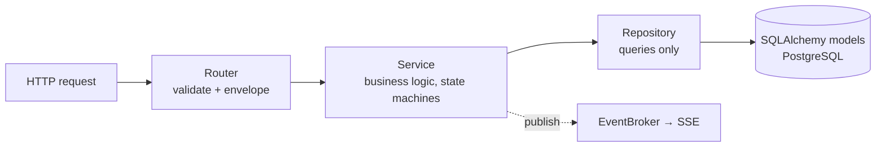
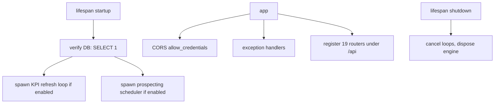

# Architecture — Backend (`backend/`)

> Part: **backend** · Type: backend (FastAPI API server) · Deep scan
> Design rationale: `_bmad-output/planning-artifacts/architecture/`. This file documents the **actual** code.

## 1. Executive Summary

The backend is the **system of record and the API**. It owns authentication, all CRUD, the job queue (which it writes; workers consume), KPI aggregation, SSE fan-out, and two background loops (KPI materialized-view refresh, prospecting scheduler). It is the only writer the frontend talks to, and it shares its PostgreSQL database with the worker fleet — workers never call back over HTTP.

Strict layering is enforced: **routers → services → repositories → models → DB**. Routers do HTTP only; services hold business logic and own transactions semantics; repositories are query-only and return ORM models; model↔schema conversion happens in services.

## 2. Technology Stack

| Category | Technology | Version | Notes |
|----------|-----------|---------|-------|
| Language | Python | 3.12+ | |
| Framework | FastAPI | ≥0.115 | async, auto OpenAPI at `/docs` |
| ASGI server | Uvicorn | ≥0.32 | standard extras |
| ORM | SQLAlchemy | ≥2.0 (async) | `async_sessionmaker`, `expire_on_commit=False` |
| DB driver | asyncpg | ≥0.30 | PostgreSQL only |
| Migrations | Alembic | ≥1.13 | head `0023_prospecting_enrich` |
| Config | pydantic-settings | ≥2.5 | Pydantic v2 |
| Auth | PyJWT ≥2.9 + bcrypt ≥4.2 | | HS256 JWT in httpOnly cookie |
| HTTP client | httpx | ≥0.27 | Google Sheets + n8n webhooks |
| Uploads | python-multipart | ≥0.0.32 | CSV import |
| Tests | pytest + pytest-asyncio | ≥8.3 / ≥0.24 | |
| Lint | ruff | ≥0.7 | rules E/F/I/UP/B |

Connection pool: `pool_size=20`, `max_overflow=10`, connect timeout 10s (the backend's slice of the ~57/100 global budget).

## 3. Layering

- **Routers** (`app/routers/`, 19 modules) — parse requests, declare auth dependency, wrap responses in the `{data, meta}` envelope. One router ⇒ one service.
- **Services** (`app/services/`) — orchestration + rules: lead/campaign state machines, NG engine, LLM breaker, dual-run state, KPI, dashboard aggregation, captcha hand-off, prospecting, webhooks. Only services call repositories.
- **Repositories** (`app/repositories/`) — `await session.execute(select(...))` only; no business logic; return models. Normalize at the edge (fqdn→lower, country→upper ISO).
- **Schemas** (`app/schemas/`, Pydantic v2) — API representation; conversion in services. Secrets are write-only (Out schemas report `{configured: bool}`, never key material).

## 4. Core Infrastructure (`app/core/`)

- **`config.py`** — pydantic-settings from env. `JWT_SECRET` is **required, no default** (fail-fast). Notable knobs: `DB_POOL_SIZE`, `JWT_EXPIRE_HOURS=8`, `COOKIE_SECURE` (true in prod), `LLM_DAILY_BUDGET_USD=5.0`, `CAPTCHA_HANDOFF_TIMEOUT_SECONDS=300`, `KPI_REFRESH_*`, `PROSPECTING_*`, `N8N_*`, `SCREENSHOTS_DIR`.
- **`database.py`** — `create_async_engine` + `async_sessionmaker`; `get_session()` FastAPI dependency.
- **`deps.py`** — `get_current_user` (decode cookie JWT, load user, check `is_active` → 401), `require_role(*roles)` factory (case-insensitive → 403), `require_admin`, `require_webhook_secret` (timing-safe `X-Webhook-Token`; empty secret = fail-closed).
- **`exceptions.py`** — `AppError` hierarchy: `NotFoundError`(404) · `BadRequestError`(400) · `UnauthorizedError`(401) · `ForbiddenError`(403) · `ConflictError`(409). Handlers in `main.py` map every error to `{error:{code,message,detail}}`; `RequestValidationError`→422 with `detail.errors`; unhandled→500 generic (details logged server-side, never leaked).
- **`logging.py`** — `log(event, *, level, **fields)` emits one JSON line to stdout with `timestamp, level, service, event` always present. Sensitive values (passwords, API keys, captcha solutions) never logged; emails reduced to domain.

## 5. Application Entry (`app/main.py`)

Background loops are cancel-safe lifespan tasks: **KPI refresh** (conditional `REFRESH MATERIALIZED VIEW CONCURRENTLY mv_submission_metrics`, ~120s) and **prospecting scheduler** (enqueue due `scheduled_for` tasks, ~30s).

## 6. Domain Correctness Gates

| Gate | Where | Rule |
|------|-------|------|
| **NG detection** | `services/ng_engine.py` (pure, zero-LLM) | `scan_text()` over active patterns; flags' detection columns immutable; functional-unique dedup |
| **LLM circuit breaker** | `services/form_understanding_service.py` (+ worker mirror) | tier from daily spend: T1 LLM-all / T2 new-only / T3 rule-only; budget≤0 ⇒ T3 |
| **Dual-run graduation** | `form_understanding_state` singleton | `consecutive_match_count ≥ 200` ⇒ rule-only; admin re-enable resets |
| **Submission checkpoint** | `jobs.checkpoint` | written before every browser side-effect; resume is idempotent |
| **Lead status machine** | `models/lead.py` `ALLOWED_TRANSITIONS` | PATCH never accepts `status`; only the status endpoint transitions |
| **Campaign lifecycle** | `models/campaign.py` | delete blocked while `running` (409) |
| **CAPTCHA timeout** | `CaptchaHandoffService.expire_stale()` | pending > 300s ⇒ `expired` ⇒ worker fails attempt `captcha_timeout` |
| **Webhook secret** | `deps.require_webhook_secret` | timing-safe; empty secret disables inbound n8n |

## 7. Real-Time (SSE)

`EventBroker` is an in-process pub/sub singleton. Services `publish(topic, payload)` (e.g. campaign lifecycle); the `/api/sse/events` endpoint subscribes per-connection, streams `{entity}.{action}` frames, and emits `: keep-alive` comments every `SSE_HEARTBEAT_SECONDS` (30s). Subscribers unsubscribe in `finally` (leak-safe).

## 8. Testing & Run

- Tests mirror `app/` (`tests/routers/`, `tests/services/`, `tests/repositories/`). DB-touching tests gate on `RUN_DB_TESTS=1` against a real Postgres; Alembic up/down is covered (`tests/test_alembic.py`).
- Run: `uv sync` → `alembic upgrade head` → `uv run uvicorn app.main:app --reload`. In Docker, `docker-entrypoint.sh` applies migrations then launches uvicorn.

See also: [API Contracts](./api-contracts-backend.md) · [Data Models](./data-models-backend.md) · [Integration Architecture](./integration-architecture.md) · [Development Guide](./development-guide.md).
