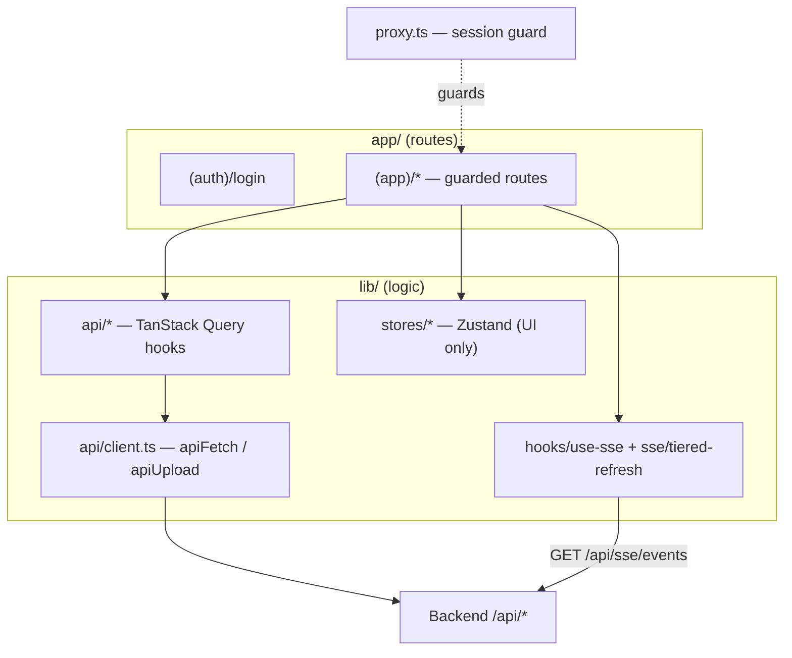

# Architecture — Frontend (`frontend/`)

> Part: **frontend** · Type: web (Next.js 16 dashboard) · Deep scan
> Design rationale: `_bmad-output/planning-artifacts/architecture/`. This file documents the **actual** code.

## 1. Executive Summary

The frontend is the **operator dashboard** — the only human-facing surface of the pipeline. It is a Next.js 16 (App Router, Turbopack) single-page-style app where operators import leads, launch campaigns, review NG flags, handle CAPTCHA hand-offs, and watch the pipeline live. It talks to the backend over REST (`/api/*`) plus one SSE stream, never to the database or workers directly.

Hard rule baked into the codebase (`AGENTS.md`): **this is Next.js 16, not the framework you remember** — middleware is `proxy.ts`, builds are `standalone`, React 19 is default. Read `node_modules/next/dist/docs/` before changing framework-level code.

## 2. Technology Stack

| Category | Technology | Version | Notes |
|----------|-----------|---------|-------|
| Framework | Next.js | 16.2.9 | App Router + Turbopack; `output: "standalone"` for Docker |
| UI runtime | React | 19.2.4 | Client-heavy dashboard |
| Language | TypeScript | ^5 | strict mode, ES2017 target |
| Styling | Tailwind CSS | ^4 | CSS variables, base color neutral, class-based dark mode |
| Components | shadcn/ui (`base-nova`) | ^4.11.0 | RSC-native, Lucide icons, configured via `components.json` |
| Server state | TanStack Query | ^5.101.0 | one client/session, no retry on 401, no refetch-on-focus |
| UI state | Zustand | ^5.0.14 | sidebar/modals only — **never server data** |
| Forms | React Hook Form | ^7.79.0 | + `zodResolver` |
| Validation | Zod | ^3.25.76 | runtime schema validation at boundaries |
| Theming | next-themes | ^0.4.6 | class strategy, localStorage, no system follow |
| Toasts | Sonner | ^2.0.7 | single `<Toaster>` in app shell |
| Testing | Vitest | ^4.1.9 | jsdom, co-located `*.test.tsx` |
| Lint | ESLint | ^9 | `eslint-config-next` (core-web-vitals + TS) |

## 3. Architecture Pattern — feature-based, layered client

**Layering rules (enforced):**
- **No raw `fetch()` in components.** Every server call goes through a TanStack Query hook in `lib/api/*`, which calls `apiFetch`/`apiFetchEnvelope`/`apiUpload` in `lib/api/client.ts`.
- `apiFetch` unwraps `{data}`; `apiFetchEnvelope` keeps `{data, meta}` for paginated lists; `apiUpload` posts multipart `FormData` (lets the browser set the boundary).
- Server data → TanStack Query. UI-only state (sidebar collapse, modals) → Zustand. The two never mix.
- Real-time → exactly one `EventSource` via `useSSE`, multiplexed to handlers.

## 4. Routing Map

Two route groups: `(auth)` (public, bare) and `(app)` (guarded, app shell). `app/page.tsx` redirects by cookie presence.

| Path | Purpose | Access |
|------|---------|--------|
| `/login` | Email + password auth | public |
| `/dashboard` | Live campaigns, alerts, today's stats | operator |
| `/leads`, `/leads/[id]`, `/leads/import` | Lead list/detail/import (CSV + Sheets) | operator |
| `/campaigns` | Campaign list & lifecycle | operator |
| `/our-info` | Sender profile groups & fields (`[o_*]` placeholders) | operator |
| `/prospecting` | AI lead sourcing — crawl / scrape / enrich tabs; templates + test-prompt | operator (templates: admin) |
| `/discovery` | Website crawl tasks | operator |
| `/review/ng` | NG flag review queue (confirm/override/skip) | operator |
| `/contact/form-understanding` | LLM dual-run calibration status | operator |
| `/contact/anti-bot-captcha` | CAPTCHA provider config | admin |
| `/contact/captcha-queue` | Operator CAPTCHA hand-off queue | operator |
| `/workers`, `/workers/[type]` | Worker status grid + job history | operator |
| `/settings/users` | User CRUD | admin |
| `/settings/integrations` | Google Sheets OAuth | admin |

## 5. Data Layer (TanStack Query)

~70 hooks across 16 endpoint groups (full catalogue in [API Contracts](./api-contracts-backend.md)). Highlights:

- **Auth:** `useAuth` (`GET /auth/me` — the session source of truth; 401 → logout + redirect), `useLogin`, `useLogout`.
- **Leads:** list/detail/CRUD + `useChangeLeadStatus`, plus CSV/Sheets `preview`+`import` mutations (dedup by `fqdn`).
- **Campaigns:** CRUD + `useCampaignLifecycle` (`start|pause|resume|complete`).
- **Prospecting (Epic 7):** `useVerifyClaudeCli`, crawl/scrape/enrich launchers, saved URLs, prompt templates, `useTestPrompt`.
- **NG / CAPTCHA / Form-understanding / Anti-bot / Workers:** review queues, hand-off queue, calibration status, worker control. Secrets are **write-only** (settings hooks never return key material).

**Cache discipline:** mutations invalidate the specific detail + all affected lists. List queries use `keepPreviousData` for smooth pagination.

## 6. State Management (Zustand — UI only)

- `useAuthStore` — a UI cache of the current user, hydrated from `useAuth()`; the httpOnly cookie + `/auth/me` are the real session. No persistence.
- `useUiStore` — `sidebarCollapsed` persisted to localStorage via Zustand `persist`. UI ephemera only.

## 7. Real-Time (SSE + tiered refresh)

`useSSE` opens one `EventSource` to `GET /api/sse/events` (`withCredentials`), auto-reconnects with bounded exponential backoff (1s→30s), and dispatches `{entity}.{action}` events to handler maps. Malformed frames are dropped silently.

Refresh is **tiered** (`lib/sse/tiered-refresh.ts`) to bound DB load:

| Zone | Cadence | Backed by |
|------|---------|-----------|
| Live | ≤5s | SSE `campaign.progress` nudge + 5s poll (dashboard) |
| Status | 10–15s | polling (`STATUS_ZONE_REFRESH_MS = 12_000`) — workers, captcha queue |
| History | 1–5 min | polling (`HISTORY_ZONE_REFRESH_MS = 120_000`) — materialized views, task history |

## 8. Entry Points

- `app/layout.tsx` — providers in order **ThemeProvider → QueryProvider → TooltipProvider**; `suppressHydrationWarning` (next-themes mutates `<html>`).
- `app/(app)/layout.tsx` — Sidebar + Header + scrollable main + single `<Toaster>`.
- `app/page.tsx` — server-side cookie check → `/dashboard` or `/login`.
- `proxy.ts` — route guard; `PUBLIC_PATHS = ["/login"]`; unauthenticated → `/login?next=…`; authenticated hitting `/login` → `/dashboard`.
- `lib/api/client.ts` — `BASE_URL = NEXT_PUBLIC_API_BASE_URL ?? http://localhost:8000/api`; `ApiError` is the only throw type; `friendlyApiMessage()` keeps raw backend text away from operators.

## 9. Error & Loading Conventions

- Backend envelope `{ error: { code, message, detail } }` → `ApiError` → toast via `friendlyApiMessage()`. Operators never see raw errors.
- Loading uses TanStack Query `isLoading`/`isPending`/`isError`; skeletons for first load, spinner for refetch. No bespoke loading state.

## 10. Build / Test / Dev

| Command | Action |
|---------|--------|
| `pnpm dev` | dev server :3000 (Turbopack HMR) |
| `pnpm build` | standalone production build |
| `pnpm start` | serve the standalone build |
| `pnpm test` | Vitest (jsdom) once |
| `pnpm lint` | ESLint 9 |

See also: [Component Inventory](./component-inventory-frontend.md) · [Integration Architecture](./integration-architecture.md) · [Development Guide](./development-guide.md).
