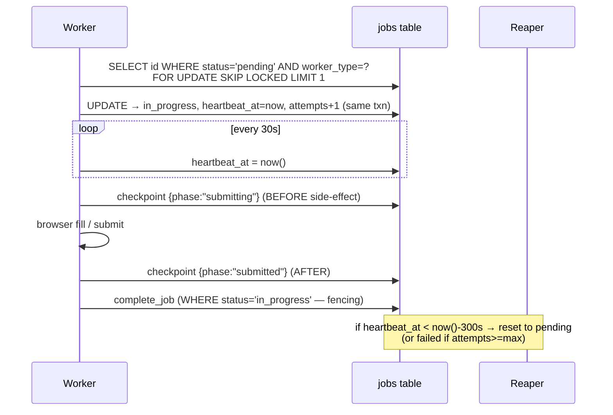
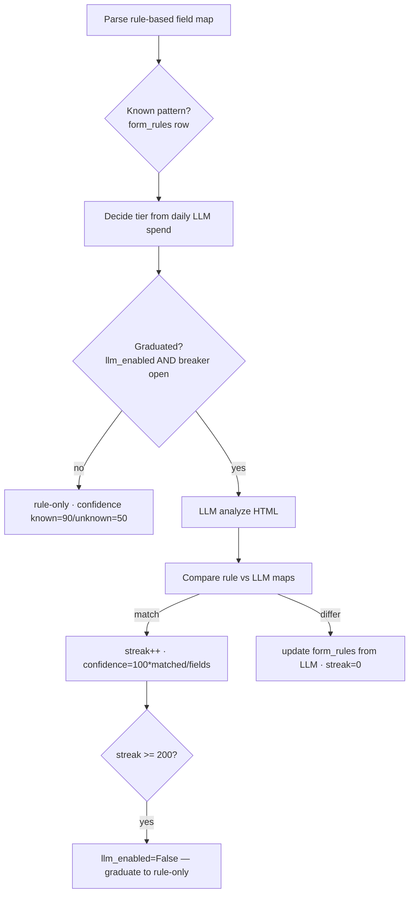

# Architecture — Workers (`workers/`)

> Part: **workers** · Type: backend (Python async + Playwright worker fleet) · Deep scan
> Design rationale: `_bmad-output/planning-artifacts/architecture/`. This file documents the **actual** code.

## 1. Executive Summary

The worker fleet is the **automation engine**. Four worker types plus a reaper poll a database-backed job queue, drive a headless Chromium browser, and write results straight back to PostgreSQL. There is **no REST callback layer** — workers and backend share one database, which eliminates idempotency concerns at the network boundary and lets the backend push changes to the frontend via SSE. Workers contain **zero imports from the backend package**: a hard deployment boundary. Schema is duplicated as SQLAlchemy Core tables in `worker/` that mirror the backend's Alembic migrations.

## 2. Technology Stack

| Category | Technology | Version | Notes |
|----------|-----------|---------|-------|
| Language | Python | 3.12+ | |
| ORM/Core | SQLAlchemy | 2.0+ (async) | asyncpg driver; direct DB updates |
| DB driver | asyncpg | ≥0.29 | |
| Browser | Playwright | ≥1.49 | Chromium only (`playwright install --with-deps chromium`) |
| HTML parse | BeautifulSoup4 + lxml | ≥4.12 / ≥5.0 | rule-based form parsing |
| Tests | pytest + pytest-asyncio | ≥8.3 / ≥0.24 | `asyncio_mode=strict` |
| Lint | ruff | ≥0.7 | |
| Packaging | uv | 0.11.7 | frozen lockfile |

## 3. Worker Types

| Worker | Module | What it does | Reads → Writes |
|--------|--------|--------------|----------------|
| **discovery** | `worker/discovery.py` | BFS crawl of a lead's site; NG scan; locate contact forms (scored selectors); checkpoint resume | `leads`,`ng_patterns`,`discovery_tasks`,`forms` → `ng_flags`,`forms`,`discovery_tasks` |
| **form** | `worker/form/worker.py` | Rule-based form parse + optional LLM dual-run; update `form_rules`; score confidence; detect platform/CAPTCHA | `forms`,`form_rules`,`form_understanding_state`,`llm_budget` → same |
| **submission** | `worker/submission/worker.py` | Rate-gate per campaign; checkpoint **before** fill/submit; record Attempt; retry w/ backoff | `campaigns`,`attempts` → `attempts` |
| **prospecting** | `worker/prospecting/worker.py` | Epic 7 — dispatch on `payload["kind"]` (crawl/scrape/enrich/test); Claude CLI; upsert leads | `prospecting_tasks`,`prompt_templates`,`leads` → same |
| **reaper** | `worker/reaper.py` | Standalone; reset stale `in_progress` jobs; retire poison jobs; purge old NG evidence | `jobs`,`ng_flags` |

All subclass `BaseWorker` (`worker/base.py`): poll loop, heartbeat, checkpoint, graceful shutdown.

## 4. Job Queue (correctness-critical)



- **Claim:** `SELECT … FOR UPDATE SKIP LOCKED` + `UPDATE` in **one** transaction — concurrent claimers never collide.
- **Heartbeat:** every `HEARTBEAT_INTERVAL_SECONDS` (default 30s) from a dedicated session.
- **Checkpoint-before-side-effect:** persist a resumable `jobs.checkpoint` **before** any browser action so a crash-retry is idempotent.
- **Reaper:** standalone `python -m worker.reaper` (`pool_size=2`); every `POLL_INTERVAL_SECONDS` (5s) resets jobs stale past `REAP_AFTER_SECONDS` (300s = 5 min); retires jobs at `attempts >= max_attempts` to `failed`.
- **Fencing token:** terminal writes apply only `WHERE status='in_progress'`; a reaped/reclaimed job blocks the stale write (`job_fence_lost`).

## 5. NG Detection — the legal gate (ZERO LLM)

`worker/ng/keyword_scanner.py` (verbatim port of the backend scanner; canonical source `scrape_ng3.py`).

- **Algorithm:** keyword exact-match (`str.find`, first hit) + regex (`finditer`, all hits) + false-positive filter regexes checked in a narrow/full context window. Results deduped, capped at 8.
- **JP normalization** (`worker/jp_normalize.py`): `normalize_width()` = NFKC fold (full-width↔half-width, ideographic space → ASCII, half-width katakana+dakuten → composed), idempotent; `normalize_jp()` adds whitespace collapse. Shared by Form Understanding (4.1) and Submission auto-fill (5.4) so both fold identically.
- **Immutable audit trail** (`ng_flags`): `method` (`keyword`/`regex`), `matched_pattern`, `snippet` (±100 chars) — **never updated** (legal record). Operational columns (`screenshot_path`, `screenshot_status`, `reviewed_at`) may change.
- **Gate enforcement:** at any match → set `leads.status='ng'` immediately, so a resumed crawl can't re-accept an already-flagged page. A functional unique index `(lead_id, method, md5(matched_pattern), md5(snippet))` + `ON CONFLICT DO NOTHING` dedupes concurrently.
- **ReDoS guard:** `REGEX_TIMEOUT_S` (5s) wall-clock; on timeout, fail-open (skip regex set, keep keyword matches), never hang.

## 6. Form Understanding — dual-run + tiered breaker + graduation



- **Tiered circuit breaker** (`breaker.py`, daily JST row in `llm_budget`): ratio = spent/budget → Tier 1 (0–70%) LLM all forms; Tier 2 (70–90%) LLM only on new patterns; Tier 3 (90%+) rule-only. Budget ≤ 0 ⇒ Tier 3 (safe degrade). Never raises — over-budget degrades, never hard-stops.
- **Graduation** (`state.py`, single row `id=1`): `consecutive_match_count` counts matched comparisons only (rule-only runs abstain); at `graduation_threshold` (200) → `llm_enabled=False`. Admin can re-enable (resets streak).
- **CAPTCHA detection** (`detect.py`): pure HTML scan for `recaptcha`/`hcaptcha`/`captcha` markers → `captcha_type` stamped on `forms`.
- **Form signature:** md5 of sorted `name:type` pairs — order-independent; same form ⇒ same hash.

## 7. Submission — crash-safe, rate-limited

`worker/submission/`:
- **Idempotency first:** `was_submitted(checkpoint)` returns early if a prior run reached a SUBMITTED phase (`submission_possible_duplicate`).
- **Gate:** campaign must be `running` with `rate_per_minute > 0`; `CampaignRateLimiter` (sliding window) admits or returns `retry_after_seconds`.
- **Checkpoint sandwich:** `{phase:"submitting"}` → `_submit()` → `{phase:"submitted"}`.
- **Auto-fill** (`form_fill.py`, pure): builds a `FillPlan` of type/select instructions; choice matching = exact normalized (NFKC fold + casefold + trim) then bounded fuzzy (ratio ≥0.85); required-unmapped → `field_unmapped` error; optional-unmapped skipped.
- **Retry** (`retry_policy.py`, pure): exponential backoff `base*2^(n-1)` capped (default 2s→60s), per-campaign `max_retries`.
- **CAPTCHA** (`captcha.py`): detection + hand-off queue (browser solve impl deferred).

## 8. Verification — selector verdict + 5-level rescue ladder

`worker/verification/` (pure `verify()`):
1. Classify matched DOM selectors into error/success hits (36-selector library in `css_patterns.py`; `[role=alert]` intentionally excluded).
2. Selector verdict: error hit → `failed`; success hit + page changed → `success`; else defer.
3. **Rescue ladder** (strongest signal first): (1) network ground-truth (POST status) → (2) form disappeared → (3) field reset → (4) field validity → (5) vision tiebreaker (deferred). First conclusive wins; missing signal abstains.
4. Returns `{status: success|failed|blocked, error_code, rescue_used, rescue_level, error_hits, success_hits}`. Codes: `verification_failed`, `verification_inconclusive` (retry-eligible).

## 9. Prospecting (Epic 7)

`worker/prospecting/` — mode registry on `payload["kind"]`, injectable `ProspectingRunner` (real `ClaudeCliRunner`, stub in tests):
- **crawl (7.2):** render prompt → Claude CLI → parse companies → dedup by FQDN → `ON CONFLICT (fqdn) DO NOTHING` upsert; clamps field lengths; country must be ISO 3166-1 alpha-2.
- **scrape (7.4):** paginated crawl.
- **enrich (7.5):** enrich/insert from structured rows, optional import-to-leads.
- **test (7.3):** prompt preview + sample output.

## 10. Connection Budget & Run Commands

Per-service pools keep the fleet under PostgreSQL's default 100: discovery/form/submission/prospecting = 10 each, reaper = 2, backend = 20, monitoring = 5 (~67 total).

```bash
# one worker (container sets WORKER_TYPE)
WORKER_TYPE=discovery python -m worker.base
# reaper (standalone)
python -m worker.reaper
```

Docker resource limits: submission gets headroom (512m / 0.75 CPU); discovery/form throttled (384m / 0.5 CPU).

## 11. Design Patterns & Known Gaps

**Patterns:** checkpoint-before-side-effect; pure offline helpers + DB-gated orchestration (testable without DB/browser); idempotency guards (`was_submitted`, `status='ng'`, `ON CONFLICT`); graceful degradation (ReDoS fail-open, breaker rule-only, control-table hiccup → degrade); immutable NG audit; one-shot transaction discipline.

**Gaps (deferred):** submission `_submit()` browser impl + `RUN_BROWSER_TESTS`; LLM analyzer client (runs rule-only until wired); vision rescue level 5; CAPTCHA browser solve; scrape/enrich landing. Tests: 37 files, gated on `RUN_DB_TESTS` / `RUN_BROWSER_TESTS` (pure helpers run offline by default).

See also: [Integration Architecture](./integration-architecture.md) · [Data Models](./data-models-backend.md) · [Development Guide](./development-guide.md).
