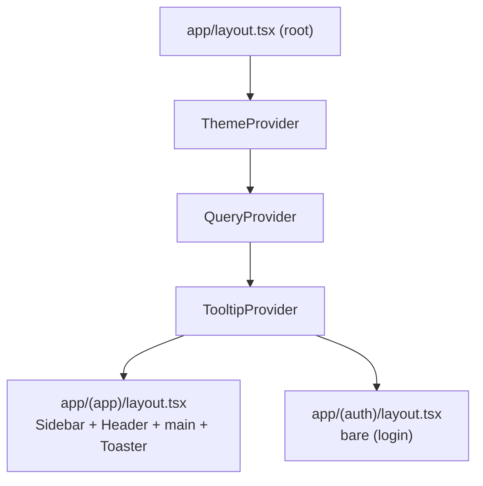

# Component Inventory — Frontend (`frontend/`)

> Part: **frontend** · Type: web (Next.js 16 dashboard) · Generated by Document Project workflow (deep scan)
> Source of truth for design intent: `_bmad-output/planning-artifacts/architecture/`. This file documents what is **actually in the code**.

The frontend follows a **feature-based** layout. Reusable chrome lives in `components/shared/`, design-system primitives in `components/ui/` (shadcn/ui, `base-nova` style), and route-specific UI is co-located under each route's `_components/` folder (not extracted into the shared set).

---

## 1. Shared Components (`components/shared/`) — custom, app-wide

| Component | File | Category | Purpose |
|-----------|------|----------|---------|
| `Header` | `header.tsx` | Layout | Page title (route → title map), user menu (logout), theme toggle, quick link to workers |
| `Sidebar` | `sidebar.tsx` | Navigation | Primary nav, 4 groups (main, review, contact forms, settings); collapsible 64px rail; RBAC-filtered (admin/operator); collapse state in localStorage |
| `LeadStatusBadge` | `lead-status-badge.tsx` | Display | Status pill — `new` / `verified` / `ng` / `excluded` / `archived` |
| `QueryProvider` | `query-provider.tsx` | Provider | One TanStack Query client per session; **no retry on 401**, no `refetchOnWindowFocus` |
| `ThemeProvider` | `theme-provider.tsx` | Provider | `next-themes` wrapper; class strategy, no system-preference following |
| `ThemeToggle` | `theme-toggle.tsx` | Form/Control | Light/dark picker |

**Count: 6 custom shared components.**

---

## 2. UI Primitives (`components/ui/`) — shadcn/ui (base-nova)

| Component | File | Category | Notes |
|-----------|------|----------|-------|
| `Button` | `button.tsx` | Form/Control | Variants: default, primary, outline, ghost, destructive; sizes xs/sm/md/lg + icon-lg |
| `Input` | `input.tsx` | Form/Control | text, email, password, date, file, search |
| `Badge` | `badge.tsx` | Display | Inline status chips |
| `Dialog` | `dialog.tsx` | Overlay | Modal for forms & confirmations |
| `DropdownMenu` | `dropdown-menu.tsx` | Navigation | Trigger + items (header user menu) |
| `Separator` | `separator.tsx` | Layout | Divider |
| `Sheet` | `sheet.tsx` | Overlay | Mobile drawer (present, not yet wired in) |
| `Tooltip` | `tooltip.tsx` | Feedback | Hover labels for the icon-only sidebar rail |
| `Sonner` | `sonner.tsx` | Feedback | Toast container, mounted once in the app shell |

**Count: 9 shadcn/ui primitives.** Managed via `components.json` (style `base-nova`, Lucide icons, RSC-native).

---

## 3. Route-Level Components (`app/**/_components/`)

Each route group keeps its page-specific building blocks co-located in a `_components/` directory rather than promoting them to `components/shared/`. This is intentional — promote to `shared/` only when a component is used by 2+ unrelated routes. Examples per the planned structure: dashboard cards (`campaign-status-card`, `alerts-panel`, `today-stats`, `worker-status-panel`), NG review (`ng-item-card`, `bulk-actions`), etc.

---

## 4. Provider Mount Order (`app/layout.tsx`)

- Root layout sets metadata (`title: tool_sales`, `description: B2B sales-form automation`) and `suppressHydrationWarning` (required by `next-themes`, which mutates the `<html>` class before hydration).
- The **Toaster (Sonner)** is mounted exactly once, in the `(app)` shell — every page fires toasts into that single instance.

---

## 5. Component Conventions

- **Naming:** `PascalCase` components/types, **`kebab-case` filenames** (`lead-status-badge.tsx`). Never `LeadStatusBadge.tsx` or `lead_status_badge.tsx`.
- **No raw `fetch()` in components** — all server data flows through TanStack Query hooks in `lib/api/`.
- **Zustand = UI state only** (sidebar collapse, modals). Server data never lives in a store.
- **Copy voice:** lowercase, terse, no trailing periods in button/menu labels.
- **Tests:** co-located Vitest (`*.test.tsx`) next to the component.

See `component-inventory-frontend.md` siblings: [Frontend Architecture](./architecture-frontend.md) · [Source Tree](./source-tree-analysis.md).
