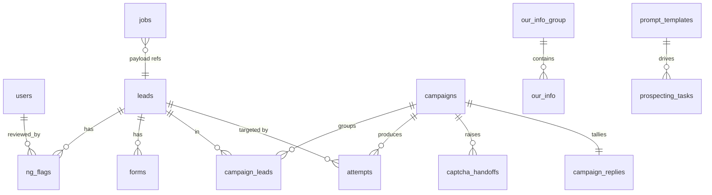

# Data Models — Backend (`backend/`)

> Part: **backend** · PostgreSQL via SQLAlchemy 2.0 async + Alembic. **19 tables + 2 views**, head migration **`0023_prospecting_enrich`**.
> Conventions: tables `snake_case` plural; FK `{singular}_id`; indexes `ix_{table}_{cols}`. **No Postgres ENUM types** — `StrEnum` strings instead. `created_at`/`updated_at` are `TIMESTAMPTZ` with DB `server_default now()` (+ `onupdate` for `updated_at`).

## Entity Map

## Core Domain

### `users`
`id` PK · `email` VARCHAR(320) UNIQUE+INDEX (lowercased) · `password_hash` (bcrypt) · `role` VARCHAR(20) StrEnum `admin|operator` · `is_active` BOOL (soft-deactivation, no hard delete) · `created_at`/`updated_at`.

### `leads`
`id` PK · `company_name` VARCHAR(255) · `fqdn` VARCHAR(255) **UNIQUE+INDEX** (import dedup key) · `email` VARCHAR(320)? · `address` VARCHAR(512)? · `country` VARCHAR(2)? (ISO 3166-1 alpha-2) · `industry` VARCHAR(128)? · `review` TEXT? (AI summary, Story 7.2/7.5) · `status` VARCHAR(20) INDEX StrEnum `new|verified|ng|excluded|archived` · timestamps.
**State machine:** `new→{verified,ng,excluded}`, `verified→archived`, `ng→verified`, `excluded→new`, `archived→∅` (terminal). Enforced in service; PATCH never accepts `status`.

### `campaigns`
`id` PK · `name` · `channel` VARCHAR(20) default `contact_form` · `status` VARCHAR(20) INDEX StrEnum `draft|running|paused|completed` · `rate_per_minute` INT default 10 · `max_retries` INT default 3 · `captcha_mode` StrEnum `human|automated|hybrid` · timestamps.
**State machine:** `draft→running`, `running→{paused,completed}`, `paused→{running,completed}`, `completed→∅`.

### `campaign_leads` (M:N)
`id` PK · `campaign_id` FK→campaigns CASCADE INDEX · `lead_id` FK→leads CASCADE INDEX · **UNIQUE(campaign_id, lead_id)** (idempotent assignment) · `created_at`.

### `attempts`
`id` PK · `campaign_id` FK CASCADE INDEX · `lead_id` FK CASCADE INDEX · `status` VARCHAR(20) INDEX StrEnum `pending|success|failed|blocked` · `error_code` VARCHAR(40)? (canonical codes) · `started_at`/`completed_at`/`duration_ms` (worker-stamped) · `created_at`. Write-once audit of every submission attempt.

## Job Queue

### `jobs`
`id` PK · `worker_type` VARCHAR(20) INDEX StrEnum `discovery|form|submission|prospecting` · `status` VARCHAR(20) StrEnum `pending|in_progress|completed|failed` (composite index `(status, worker_type)` for `SELECT … FOR UPDATE SKIP LOCKED` claim) · `payload` JSONB · `checkpoint` JSONB? (written **before** side-effects) · `heartbeat_at` TIMESTAMPTZ? (reaper resets stale >5 min) · `attempts`/`max_attempts` INT · `last_error` TEXT? · `started_at`/`completed_at` · timestamps.

## NG Detection (legal audit)

### `ng_patterns`
`id` PK · `pattern_type` VARCHAR(20) INDEX StrEnum `keyword|regex|false_positive` · `value` TEXT · `is_active` BOOL (only active rows scanned) · timestamps. **Seeded** ~40 keywords / 25 regexes / 10 false-positive (migration `0007`).

### `ng_flags` — immutable audit trail
`id` PK · `lead_id` FK CASCADE INDEX · `method` VARCHAR(16) StrEnum `keyword|regex` *(immutable)* · `matched_pattern` TEXT *(immutable)* · `snippet` TEXT *(immutable)* · `page_url` VARCHAR(2048)? *(immutable)* · `status` VARCHAR(20) INDEX StrEnum `pending|confirmed|overridden|skipped` *(mutable via review only)* · `created_at` *(immutable)* · `screenshot_path` VARCHAR(512)? · `screenshot_status` StrEnum `none|captured|failed|purged` · `reviewed_at`? · `reviewed_by` FK→users?.
**Functional unique index** `(lead_id, method, md5(matched_pattern), md5(snippet))` → idempotent concurrent insert via `ON CONFLICT DO NOTHING`.
View **`ng_flag_review_queue`** (migration `0010`): pending flags joined to leads, ordered by `created_at`.

## Forms & Form Understanding

### `forms`
`id` PK · `lead_id` FK CASCADE INDEX · `page_url` VARCHAR(2048) · `fields` JSONB? (light snapshot, not authoritative) · `platform` VARCHAR(50)? · `captcha_type` VARCHAR(30)? · `confidence` NUMERIC(4,3)? · `status` StrEnum `discovered|analyzed` · timestamps · **UNIQUE(lead_id, page_url)** (re-crawl idempotency).

### `form_rules` (calibration store)
`id` PK · `domain` VARCHAR(255) INDEX · `form_signature_hash` VARCHAR(64) · `platform`? · `field_map` JSONB? (authoritative mapping, dual-run maintained) · `source` StrEnum `rule|llm|dual_run` · timestamps · **UNIQUE(domain, form_signature_hash)**.

### `form_understanding_state` (singleton, `id=1`)
`consecutive_match_count` INT · `llm_enabled` BOOL · `graduation_threshold` INT default 200 · `total_comparisons`/`total_matches` · `last_disagreement_at`?/`last_disagreement_detail` JSONB? · `updated_at`. Worker writes via Core mirror; backend reads + admin re-enable.

### `llm_budget` (daily spend)
`id` PK · `spend_date` DATE **UNIQUE** (JST calendar) · `spent_usd` NUMERIC(10,4) · `call_count` INT · timestamps. Drives the tiered circuit breaker.

## Discovery / Prospecting

### `discovery_tasks`
`id` PK · `source_type` StrEnum `leads|urls` · `depth` INT default 3 · `stop_after_first` BOOL · `respect_robots` BOOL · counters `total/processed/ng_flagged/forms_found` · `status` StrEnum `running|completed|failed` · `created_by` FK→users SET NULL? · timestamps.

### `prospecting_tasks`
`id` PK · `mode` StrEnum `crawl|scrape|enrich|test` · `url` VARCHAR(2048)? (nullable for enrich) · `count` INT · `keywords`? · `status` INDEX StrEnum `scheduled|running|completed|failed` · `companies_found` · `pages` INT (scrape depth, `0022`) · `scheduled_for`? (gated scheduler) · `started_at`/`completed_at`/`error` · `template_id` FK→prompt_templates SET NULL? · `sample_output` TEXT? (test mode) · `input_data` TEXT? (enrich rows, `0023`) · `import_requested` BOOL · `created_by` FK? · timestamps.

### `prompt_templates`
`id` PK · `name` VARCHAR(120) UNIQUE · `body` TEXT (`{{url}}/{{count}}/{{keywords}}` placeholders) · `is_default` BOOL (**partial unique** WHERE `is_default=true` → one default) · `created_by` FK? · timestamps. Default template is delete-protected.

### `prospecting_saved_urls`
`id` PK · `url` VARCHAR(2048) UNIQUE · `label`? · `created_by` FK? · `created_at`.

## Settings & Integrations

### `anti_bot_settings` (singleton, `id=1`)
`typing_delay_ms` · `stealth_enabled`/`headless_enabled`/`image_loading_enabled` BOOL · `user_agent_override`? · `captcha_type_mapping` JSONB (`{recaptcha_v2:"2captcha"}`) · `two_captcha_api_key`/`anti_captcha_api_key`/`capsolver_api_key` **write-only** (never serialized back; Out reports `{configured: bool}`).

### `captcha_handoffs`
`id` PK · `campaign_id`/`lead_id` FK CASCADE INDEX · `captcha_type` VARCHAR(30) · `image_url`?/`widget_payload` JSONB? (≥1 present) · `target_url` (resume here) · `status` INDEX StrEnum `pending|solved|expired|cancelled` · `solution` TEXT? (**never logged**) · `created_at`/`expires_at`?/`resolved_at`?.

### `google_connection` (singleton)
`client_id` · `client_secret` **write-only** · `refresh_token` **write-only** · timestamps. Status endpoint returns `{client_id, is_configured}` only.

### `our_info_group` / `our_info`
`our_info_group`: `id` · `name` VARCHAR(80) UNIQUE (seeded **General**, **JP Market**, migration `0005`). `our_info`: `id` · `name` · `value` TEXT (`[o_name]` resolves here) · `group_id` FK INDEX · timestamps.

## KPI & Worker Control

### `campaign_replies`
`id` PK · `campaign_id` FK CASCADE **UNIQUE** (one per campaign) · `reply_count` INT · `updated_at`. Manual operator-entered count.

### `mv_submission_metrics` (materialized view, migration `0018`)
Aggregates `attempts` by status/campaign/date. Refreshed conditionally by the backend KPI loop (`REFRESH MATERIALIZED VIEW CONCURRENTLY`, ~120s, only when new attempts exist). Requires a UNIQUE index for `CONCURRENTLY`.

### `worker_controls`
`id` PK · `worker_type` VARCHAR(20) UNIQUE · `desired_state` StrEnum `running|stopped` (operator intent) · `last_seen_at`? (worker liveness) · `restart_requested_at`? · `updated_at`. **Seeded** one row per worker type (migration `0019`).

## Migration History (Alembic)

| Rev | Story | Adds |
|-----|-------|------|
| `0001_baseline` | 1.1 | empty root |
| `0002_users` | 1.3 | `users` |
| `0003_leads` | 2.1 | `leads` |
| `0004_google_connection` | 2.4 | `google_connection` |
| `0005_our_info` | 2.6 | `our_info_group` (seeded) + `our_info` |
| `0006_jobs` | 3.1 | `jobs` (claim index) |
| `0007_ng_detection` | 3.2 | `ng_patterns` (seeded) |
| `0008_discovery_and_forms` | 3.3 | `discovery_tasks`, `forms` |
| `0009_ng_screenshot` | 3.4 | `ng_flags` screenshot cols |
| `0010_ng_review` | 3.5 | `ng_flags` review cols + queue view |
| `0011_form_rules` | 4.1 | `form_rules` |
| `0012_llm_budget` | 4.2 | `llm_budget` |
| `0013_form_understanding_state` | 4.3 | `form_understanding_state` |
| `0014_campaigns` | 5.1 | `campaigns`, `campaign_leads` |
| `0015_anti_bot_settings` | 5.3 | `anti_bot_settings` |
| `0016_attempts` | 5.4 | `attempts` |
| `0017_captcha_handoff` | 5.5 | `captcha_handoffs` |
| `0018_kpi_views` | 6.2 | `campaign_replies` + `mv_submission_metrics` |
| `0019_worker_controls` | 6.4 | `worker_controls` (seeded) |
| `0020_prospecting` | 7.1 | `prospecting_tasks`, `prospecting_saved_urls` |
| `0021_prompt_templates` | 7.3 | `prompt_templates` (seeded default) |
| `0022_prospecting_pages` | 7.4 | `prospecting_tasks.pages` |
| `0023_prospecting_enrich` | 7.5 | `prospecting_tasks.{input_data,import_requested}`, `url` nullable — **HEAD** |

**Notes:** Workers duplicate these schemas as SQLAlchemy **Core** tables in `workers/worker/` (no cross-boundary import). Migration discipline for parallel branches lives in `WORKTREE_RULES.md` (reserve revision id, merge with `alembic merge heads`, never renumber).

See also: [Backend Architecture](./architecture-backend.md) · [API Contracts](./api-contracts-backend.md) · [Workers Architecture](./architecture-workers.md).
