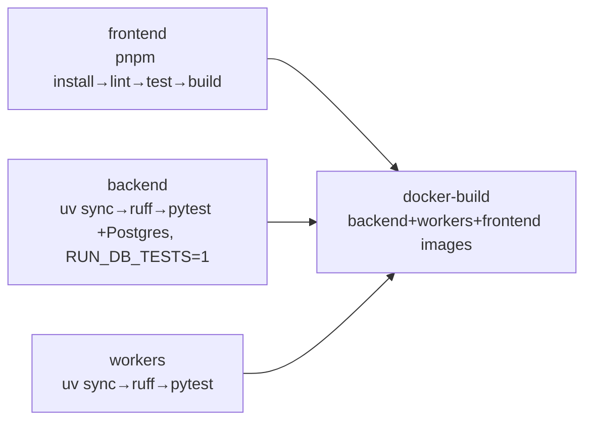

# Deployment Guide

> Single-server Docker Compose stack. Two environments: **development** (local Compose) and **production** (server). No staging.

## 1. Service Topology (`docker-compose.yml`)

| Service | Build / Image | Port | Depends on | Role |
|---------|---------------|------|------------|------|
| `postgres-archive-init` | postgres:16-alpine | — | — | one-shot: chown WAL archive volume |
| `postgres` | postgres:16-alpine | 5432 | archive-init | primary DB; WAL archiving for PITR; `pg_isready` healthcheck |
| `backend` | build `./backend` | 8000 | postgres (healthy) | FastAPI; runs `alembic upgrade head` on entrypoint; `/api/health` healthcheck |
| `frontend` | build `./frontend` | 3000 | backend (healthy) | Next.js standalone; `NEXT_PUBLIC_API_BASE_URL` inlined at build |
| `worker-discovery` | build `./workers` | — | postgres | NG scan + form discovery; 384m / 0.5 CPU; pool 10 |
| `worker-form` | build `./workers` | — | postgres | form understanding; 384m / 0.5 CPU; pool 10 |
| `worker-submission` | build `./workers` | — | postgres | fill + submit; **512m / 0.75 CPU** (priority); pool 10 |
| `worker-prospecting` | build `./workers` | — | postgres | Epic 7 AI sourcing (needs Claude CLI); pool 10 |
| `worker-reaper` | build `./workers` (custom CMD) | — | postgres | resets stale jobs (5 min); purges old NG evidence; pool 2 |
| `n8n` | n8nio/n8n:stable | 5678 | — | **optional** (`--profile optional`) orchestration |
| `loki` | grafana/loki:3.0.0 | 3100 | — | **optional** (`--profile monitoring`) logs |
| `promtail` | grafana/promtail:3.0.0 | — | loki | scrapes container stdout → Loki |
| `grafana` | grafana/grafana:11.1.0 | 3001 | loki | dashboards (anon viewer) |

**Volumes:** `postgres_data`, `postgres_wal_archive`, `n8n_data`, `loki_data`, `grafana_data`.

## 2. Connection Budget

Per-service pool sizes keep total connections under PostgreSQL's default 100:

| backend | discovery | form | submission | prospecting | reaper | monitoring | **total** |
|---------|-----------|------|------------|-------------|--------|------------|-----------|
| 20 (+10) | 10 | 10 | 10 | 10 | 2 | 5 | **~67** |

Each service sets `DB_POOL_SIZE`; the `*_DB_POOL_SIZE` env vars override per worker type.

## 3. Bring It Up

```bash
# 1. configure
cp .env.example .env        # set JWT_SECRET (required), POSTGRES_*, ADMIN_*, etc.

# 2. core stack (db → backend(migrate) → frontend → workers)
docker compose up -d

# 3. seed the first admin
docker compose exec backend python -m app.scripts.create_admin   # uses ADMIN_EMAIL / ADMIN_PASSWORD

# 4. optional profiles
docker compose --profile monitoring up -d loki promtail grafana
docker compose --profile optional   up -d n8n
```

Access: frontend `http://localhost:3000` · API docs `http://localhost:8000/docs` · Grafana `http://localhost:3001`.

## 4. Critical Environment Variables

> Full list with defaults in `.env.example`. Secrets live only in env — never commit `.env`.

- **Required:** `JWT_SECRET` (no default — backend fails fast if empty), `POSTGRES_USER/PASSWORD/DB`, `ADMIN_EMAIL/ADMIN_PASSWORD`.
- **Production must change:** `COOKIE_SECURE=true`, real `JWT_SECRET`, `WAL_ARCHIVE_DEST` → **remote** path (S3/rsync/NAS — local-only WAL is lost with the server), `CORS_ORIGINS` → real frontend origin, `NEXT_PUBLIC_API_BASE_URL` → public API URL (rebuild frontend after changing).
- **Feature toggles:** `LLM_DAILY_BUDGET_USD`, `CAPTCHA_HANDOFF_TIMEOUT_SECONDS`, `KPI_REFRESH_ENABLED/INTERVAL`, `PROSPECTING_SCHEDULER_ENABLED/INTERVAL`, `PROSPECTING_CLAUDE_BIN`, `N8N_WEBHOOK_SECRET`, `N8N_COMPLETION_WEBHOOK_URL`.

## 5. CI/CD (`.github/workflows/ci.yml`)

Four jobs; lint + test run in parallel, then images build:



- **frontend:** Node 22 + pnpm 10 (frozen lock) → `lint`, `test`, `build`.
- **backend:** Python 3.12 (uv) + Postgres 16 service (health-gated), `RUN_DB_TESTS=1` → `ruff check` + `pytest` (includes Alembic migration tests).
- **workers:** Python 3.12 (uv) → `ruff check` + `pytest`.
- **docker-build:** after all three pass; builds the three images (no registry push — manual/local deploy).

Deploy is **manual**: SSH to server → `docker compose pull && docker compose up -d` (single server, no auto-deploy risk).

## 6. Observability

```
services (stdout JSON {service,event,level,timestamp})
  → promtail (docker_sd, parse JSON → labels)
  → loki (filesystem TSDB)
  → grafana (LogQL dashboards: pipeline-overview, worker-health)
```

Verification logs carry `selector_matched`, `rescue_used`, `rescue_level`; worker logs carry `job_id`, `lead_id`. Config under `monitoring/` (`loki-config.yml`, `promtail-config.yml`, grafana provisioning).

## 7. Data Safety

- **WAL archiving** → continuous archive + point-in-time recovery. NG records have legal weight, so production must archive to remote storage.
- **Healthchecks** gate startup ordering: postgres (`pg_isready`) → backend (`/api/health`) → frontend; workers depend on postgres health.
- **Migrations:** backend applies `alembic upgrade head` on boot; workers assume schema is ready. Parallel-branch migration rules in `WORKTREE_RULES.md` (reserve revision id; merge with `alembic merge heads`, never renumber).

## 8. Static UX Preview (not part of the stack)

`index.html` + `.nojekyll` at the repo root let GitHub Pages serve the UX mockup index (links into `_bmad-output/ux-designs/`). It is unrelated to the Docker deployment.

See also: [Integration Architecture](./integration-architecture.md) · [Development Guide](./development-guide.md).
