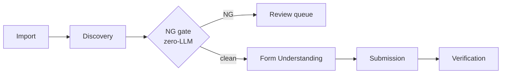

# `tool_sales` — Project Documentation Index

> **Primary entry point for AI-assisted development.** Generated by the Document Project workflow (deep scan) on 2026-06-20.
> Point brownfield PRD / feature-planning workflows at this file.

## Project Overview

- **Type:** monorepo with **3 deployable parts** + observability stack
- **Product:** Japanese B2B sales-form automation pipeline (~12,000 submissions/day, 5 operators)
- **Primary languages:** TypeScript (frontend), Python 3.12 (backend + workers)
- **Architecture:** REST + SSE (frontend↔backend) · **direct shared DB** (workers↔backend, no REST callback)
- **Status:** 7 epics / 38 stories implemented · backend migrations head `0023_prospecting_enrich`

## Quick Reference by Part

### frontend — Operator Dashboard (`frontend/`)
- **Type:** web · **Stack:** Next.js 16.2, React 19, TanStack Query, Zustand, shadcn/ui, Vitest
- **Entry:** `app/layout.tsx`, `app/(app)/layout.tsx`, `proxy.ts`, `lib/api/client.ts`
- ⚠ Next.js 16 — middleware is `proxy.ts`, builds are `standalone` (see `frontend/AGENTS.md`)

### backend — API Server (`backend/`)
- **Type:** backend · **Stack:** FastAPI, SQLAlchemy 2.0 async, Alembic, Pydantic v2
- **Entry:** `app/main.py` · **Layering:** routers → services → repositories → DB
- 19 routers · 19 tables + 2 views · 23 Alembic migrations

### workers — Automation Fleet (`workers/`)
- **Type:** backend · **Stack:** Python 3.12, Playwright (Chromium), asyncpg
- **Entry:** `worker/base.py` (`WORKER_TYPE=…`), `worker/reaper.py`
- Worker types: discovery · form · submission · prospecting · reaper · DB-based job queue (`SKIP LOCKED` + heartbeat + reaper)

## Generated Documentation

- [Project Overview](./project-overview.md)
- [Source Tree Analysis](./source-tree-analysis.md)
- **Frontend:** [Architecture](./architecture-frontend.md) · [Component Inventory](./component-inventory-frontend.md)
- **Backend:** [Architecture](./architecture-backend.md) · [API Contracts](./api-contracts-backend.md) · [Data Models](./data-models-backend.md)
- **Workers:** [Architecture](./architecture-workers.md)
- **Cross-cutting:** [Integration Architecture](./integration-architecture.md) · [Deployment Guide](./deployment-guide.md) · [Development Guide](./development-guide.md)
- **Metadata:** [project-parts.json](./project-parts.json) · [project-scan-report.json](./project-scan-report.json)

## Setup Guides / Runbooks

- [Prospecting Claude CLI Setup](./prospecting-claude-cli-setup.md) — make the `claude` CLI run **inside Docker** so Verify CLI + crawls work (binary mount · `IS_SANDBOX=1` root-guard · isolated `CLAUDE_CONFIG_DIR` creds); local-dev override + production notes (Epic 7 / Story 7.1)

## Existing Documentation (in-repo)

- **AI rule sheet:** [`_bmad-output/project-context.md`](../_bmad-output/project-context.md) — non-obvious rules agents must follow
- **Design source of truth:** `_bmad-output/planning-artifacts/architecture/` — core decisions, structure & boundaries, consistency rules
- **Product:** `_bmad-output/planning-artifacts/prds/…`, `briefs/…`, `epics.md`, `ux-designs/…`
- **Per-part:** `frontend/AGENTS.md`, `frontend/CLAUDE.md`, `frontend/README.md`, `monitoring/README.md`, `WORKTREE_RULES.md`

## Getting Started

```bash
cp .env.example .env          # set JWT_SECRET (required), POSTGRES_*, ADMIN_*
docker compose up -d          # postgres → backend(migrate) → frontend → workers
docker compose exec backend python -m app.scripts.create_admin
# frontend http://localhost:3000 · API docs http://localhost:8000/docs
```

Per-part local dev, conventions, and house rules: [Development Guide](./development-guide.md).

## Pipeline (one glance)



**NG Detection is a mandatory legal gate** — no path reaches Submission without passing keyword + regex screening, with an immutable audit trail.
