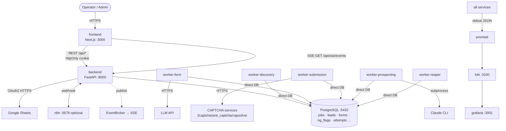

# Integration Architecture

> How the three parts (frontend / backend / workers) and external services connect. Monorepo, single shared PostgreSQL.

## 1. System Topology



## 2. The Golden Rule — workers talk to the DB, not the API

The defining architectural decision: **workers communicate with the backend via direct database updates, with no REST callback layer.** Both share one PostgreSQL instance. This eliminates network idempotency concerns, removes a whole API surface, and lets the backend observe job state by reading the DB and push changes to the frontend over SSE.

| From → To | Mechanism | Details |
|-----------|-----------|---------|
| Frontend → Backend | REST `/api/*` | All CRUD; httpOnly `access_token` cookie; `NEXT_PUBLIC_API_BASE_URL` inlined at build |
| Browser → Backend | SSE | `GET /api/sse/events`, long-lived; alert zone; 30s keep-alive |
| Backend → PostgreSQL | asyncpg | pool 20 (+10 overflow) |
| Workers → PostgreSQL | asyncpg (**direct**) | claim via `FOR UPDATE SKIP LOCKED`; write `jobs`/`leads`/`forms`/`ng_flags`/`attempts`; pools 10 each (reaper 2) |
| Submission worker → CAPTCHA | HTTPS | provider per `anti_bot_settings.captcha_type_mapping`; timeout → `captcha_timeout` |
| Form worker → LLM | HTTPS | gated by tiered breaker + daily budget; analyzer client deferred (rule-only until wired) |
| Prospecting worker → Claude CLI | subprocess | `PROSPECTING_CLAUDE_BIN`; `--version` health check (20s) |
| Backend ↔ n8n | HTTP webhook | inbound `POST /api/webhooks/n8n/campaigns/{id}/start\|pause`, `GET …/status` (X-Webhook-Token); outbound completion POST on `campaign.completed` |
| Backend → Google Sheets | OAuth2 HTTPS | refresh-token exchange; lead import |
| All services → Observability | stdout JSON | promtail → loki → grafana |

## 3. End-to-End Pipeline Flow

```mermaid
sequenceDiagram
    participant FE as Frontend
    participant BE as Backend
    participant DB as PostgreSQL
    participant WD as worker-discovery
    participant WF as worker-form
    participant WS as worker-submission
    FE->>BE: import leads, create + start campaign
    BE->>DB: insert leads, campaign; enqueue discovery/submission jobs; publish SSE
    WD->>DB: claim discovery job → crawl → NG scan
    alt NG match
        WD->>DB: ng_flags insert (immutable), leads.status='ng'
    else clean
        WD->>DB: forms insert (contact form found)
    end
    WF->>DB: claim form job → parse + dual-run → forms.status='analyzed'
    WS->>DB: claim submission job → checkpoint → fill+submit → attempts insert
    BE-->>FE: SSE campaign.progress (dashboard live zone)
```

Pipeline order: **import → discovery → NG gate → form understanding → submission → verification**. NG detection is a mandatory gate — no path reaches submission without passing it.

## 4. Tiered Real-Time Refresh

The frontend bounds DB load by matching refresh cadence to data volatility (`lib/sse/tiered-refresh.ts`):

| Zone | Cadence | Transport |
|------|---------|-----------|
| Live (dashboard) | ≤5s | SSE `campaign.progress` nudge + 5s poll |
| Status (workers, captcha queue) | 12s | polling |
| History (KPI, task history) | 120s | polling (backed by materialized view) |

## 5. External Integration Points

| Service | Used by | Notes |
|---------|---------|-------|
| CAPTCHA (2captcha / anti_captcha / capsolver / ocr) | submission worker | keys write-only in `anti_bot_settings`; per-type provider mapping; human hand-off fallback queue |
| LLM API | form worker | budget-gated circuit breaker; auto-disable after 200-match graduation |
| Claude CLI | prospecting worker | crawl/scrape/enrich AI lead sourcing (Epic 7) |
| n8n | backend | **optional** (`--profile optional`); campaign control webhooks + completion notify |
| Google Sheets | backend | OAuth2 lead import |

## 6. Boundaries (do not cross)

- Frontend never touches the DB or workers — only `/api/*`.
- Workers never import the backend package and never call its API — DB only. Schemas are duplicated as SQLAlchemy Core tables in `workers/worker/`.
- Only backend **services** call repositories; routers never query the DB directly.
- Secrets (JWT, CAPTCHA keys, Google creds, n8n secret) live in env/`.env`, never in code, never returned by an API.

See also: [Backend Architecture](./architecture-backend.md) · [Workers Architecture](./architecture-workers.md) · [Frontend Architecture](./architecture-frontend.md) · [Deployment Guide](./deployment-guide.md).
