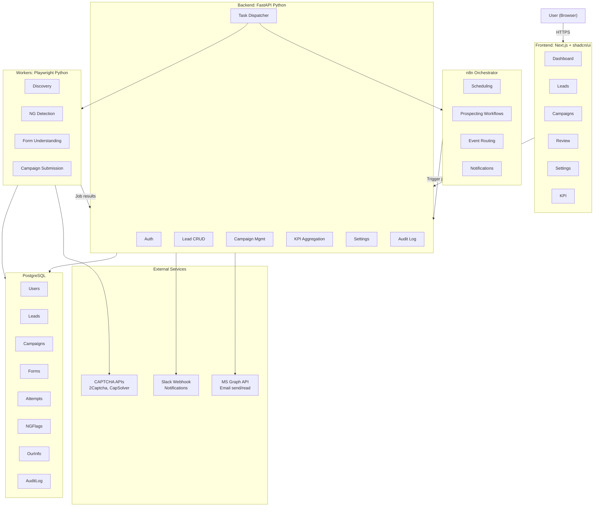
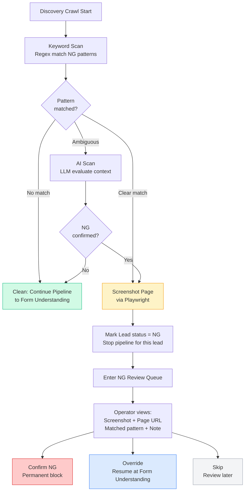
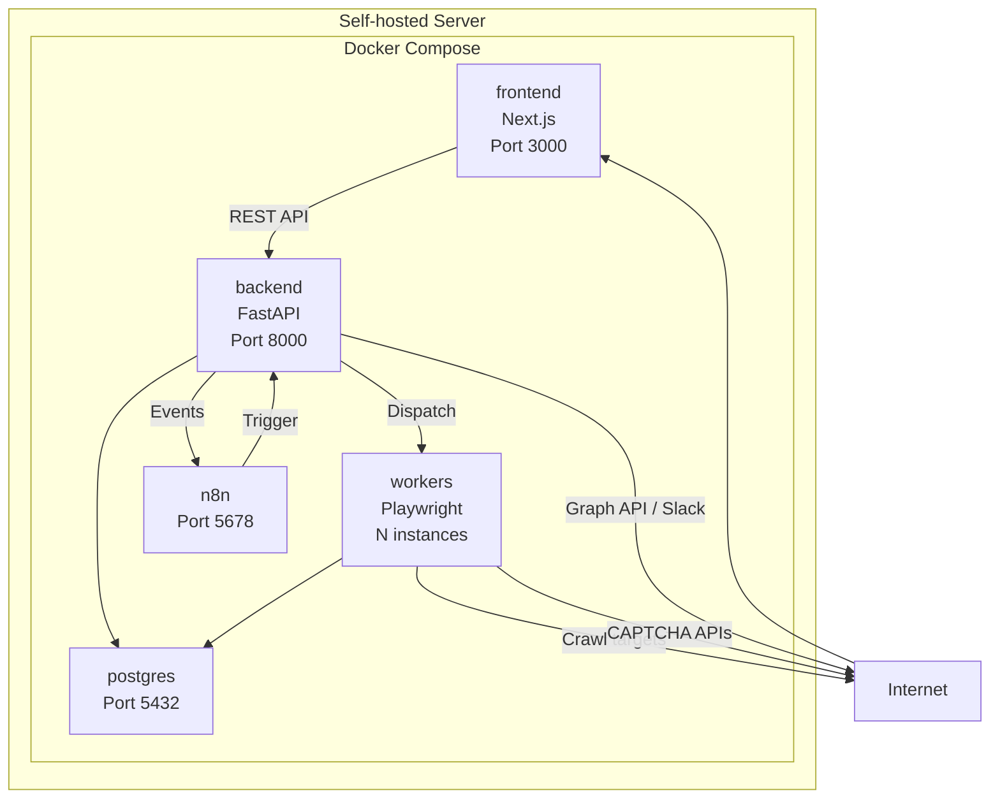
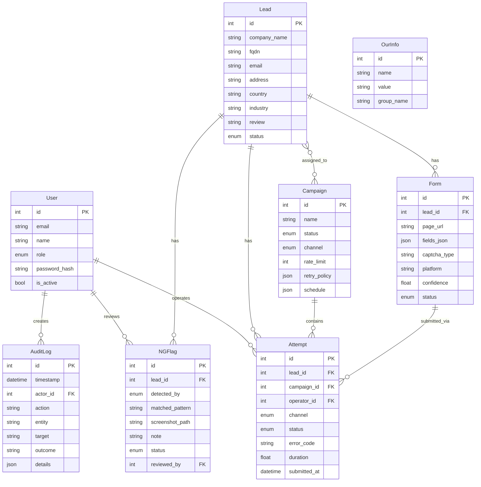

# Sales Automation Tool - Architecture Diagrams

## 3.1 System Architecture

```mermaid
graph TB
    User["User (Browser)"]

    subgraph Frontend["Frontend: Next.js + shadcn/ui"]
        Dashboard
        Leads
        Campaigns
        Review
        Settings
        KPI
    end

    subgraph Backend["Backend: FastAPI Python"]
        Auth
        LeadCRUD["Lead CRUD"]
        CampaignMgmt["Campaign Mgmt"]
        KPIAgg["KPI Aggregation"]
        SettingsMgmt["Settings"]
        AuditMgmt["Audit Log"]
        TaskDispatcher["Task Dispatcher"]
    end

    subgraph Workers["Workers: Playwright Python"]
        Discovery
        NGDetect["NG Detection"]
        FormAI["Form Understanding"]
        Submission["Campaign Submission"]
    end

    subgraph Orchestrator["n8n Orchestrator"]
        Scheduling
        Prospecting["Prospecting Workflows"]
        EventRoute["Event Routing"]
        Notify["Notifications"]
    end

    subgraph DB["PostgreSQL"]
        UsersDB["Users"]
        LeadsDB["Leads"]
        CampaignsDB["Campaigns"]
        Forms
        Attempts
        NGFlags
        OurInfo
        AuditLog
    end

    subgraph External["External Services"]
        CaptchaAPI["CAPTCHA APIs<br/>2Captcha, CapSolver"]
        GraphAPI["MS Graph API<br/>Email send/read"]
        Slack["Slack Webhook<br/>Notifications"]
    end

    User -->|HTTPS| Frontend
    Frontend -->|REST API JSON| Backend
    TaskDispatcher --> Workers
    TaskDispatcher --> Orchestrator
    Backend --> DB
    Workers --> DB
    Workers --> CaptchaAPI
    Workers -->|Job results| Backend
    Orchestrator -->|Trigger jobs| Backend
    Backend --> Slack
    Backend --> GraphAPI
```

## 3.2 Main Pipeline

```mermaid
flowchart LR
    Import["1. Import Leads<br/>CSV / Sheets / BaseConnect"]
    LeadReview["2. Lead Review<br/>Verify / Exclude"]
    Discovery["3. Discovery<br/>Crawl website"]
    NG{"4. NG<br/>Detected?"}
    NGQueue["NG Review Queue<br/>Screenshot + Note"]
    FormAI["5. Form Understanding<br/>AI analyze"]
    FormReview["6. Form Review<br/>Approve / Reject"]
    Submit["7. Campaign Submission<br/>Fill + CAPTCHA + Submit"]
    Verify["8. Verification<br/>CSS pattern match"]
    Success["Success"]
    Failed["Failed<br/>error code"]
    Blocked["Blocked"]

    Import --> LeadReview
    LeadReview --> Discovery
    Discovery --> NG
    NG -->|Yes| NGQueue
    NG -->|No| FormAI
    NGQueue -->|Override| FormAI
    NGQueue -->|Confirm NG| Blocked
    FormAI --> FormReview
    FormReview --> Submit
    Submit --> Verify
    Verify -->|Success| Success
    Verify -->|Failed| Failed

    style NG fill:#fef3c7,stroke:#f59e0b
    style NGQueue fill:#fee2e2,stroke:#ef4444
    style Blocked fill:#fecaca,stroke:#dc2626
    style Success fill:#d1fae5,stroke:#10b981
    style Failed fill:#fecaca,stroke:#dc2626
```

## 3.3 NG Detection Flow

```mermaid
flowchart TD
    Start["Discovery Crawl Start"]
    Keyword["Keyword Scan<br/>Regex match NG patterns"]
    KeywordHit{"Pattern<br/>matched?"}
    AI["AI Scan<br/>LLM evaluate context"]
    AIResult{"NG<br/>confirmed?"}
    Clean["Clean: Continue Pipeline<br/>to Form Understanding"]
    Screenshot["Screenshot Page<br/>via Playwright"]
    MarkNG["Mark Lead status = NG<br/>Stop pipeline for this lead"]
    Queue["Enter NG Review Queue"]
    OperatorView["Operator views:<br/>Screenshot + Page URL<br/>Matched pattern + Note"]
    Confirm["Confirm NG<br/>Permanent block"]
    Override["Override<br/>Resume at Form Understanding"]
    Skip["Skip<br/>Review later"]

    Start --> Keyword
    Keyword --> KeywordHit
    KeywordHit -->|Clear match| Screenshot
    KeywordHit -->|No match| Clean
    KeywordHit -->|Ambiguous| AI
    AI --> AIResult
    AIResult -->|Yes| Screenshot
    AIResult -->|No| Clean
    Screenshot --> MarkNG
    MarkNG --> Queue
    Queue --> OperatorView
    OperatorView --> Confirm
    OperatorView --> Override
    OperatorView --> Skip

    style Clean fill:#d1fae5,stroke:#10b981
    style Confirm fill:#fecaca,stroke:#dc2626
    style Override fill:#dbeafe,stroke:#3b82f6
    style Skip fill:#f3f4f6,stroke:#9ca3af
    style Screenshot fill:#fef3c7,stroke:#f59e0b
```

## 3.4 Deployment: Docker Compose

```mermaid
graph TB
    subgraph Server["Self-hosted Server"]
        subgraph Docker["Docker Compose"]
            FE["frontend<br/>Next.js<br/>Port 3000"]
            BE["backend<br/>FastAPI<br/>Port 8000"]
            WK["workers<br/>Playwright<br/>N instances"]
            N8N["n8n<br/>Port 5678"]
            PG["postgres<br/>Port 5432"]
        end
    end

    FE -->|REST API| BE
    BE --> PG
    WK --> PG
    BE -->|Dispatch| WK
    N8N -->|Trigger| BE
    BE -->|Events| N8N

    Internet["Internet"] --> FE
    WK -->|Crawl targets| Internet
    WK -->|CAPTCHA APIs| Internet
    BE -->|Graph API / Slack| Internet
```

## 3.5 Data Model: ER Diagram

```mermaid
erDiagram
    User ||--o{ Attempt : operates
    User ||--o{ AuditLog : creates
    User ||--o{ NGFlag : reviews

    Lead ||--o{ Form : has
    Lead ||--o{ Attempt : has
    Lead ||--o{ NGFlag : has
    Lead }o--o{ Campaign : assigned_to

    Campaign ||--o{ Attempt : contains

    Form ||--o{ Attempt : submitted_via

    User {
        int id PK
        string email
        string name
        enum role
        string password_hash
        bool is_active
    }

    Lead {
        int id PK
        string company_name
        string fqdn
        string email
        string address
        string country
        string industry
        string review
        enum status
    }

    Campaign {
        int id PK
        string name
        enum status
        enum channel
        int rate_limit
        json retry_policy
        json schedule
    }

    Form {
        int id PK
        int lead_id FK
        string page_url
        json fields_json
        string captcha_type
        string platform
        float confidence
        enum status
    }

    Attempt {
        int id PK
        int lead_id FK
        int campaign_id FK
        int operator_id FK
        enum channel
        enum status
        string error_code
        float duration
        datetime submitted_at
    }

    NGFlag {
        int id PK
        int lead_id FK
        enum detected_by
        string matched_pattern
        string screenshot_path
        string note
        enum status
        int reviewed_by FK
    }

    OurInfo {
        int id PK
        string name
        string value
        string group_name
    }

    AuditLog {
        int id PK
        datetime timestamp
        int actor_id FK
        string action
        string entity
        string target
        string outcome
        json details
    }
```
