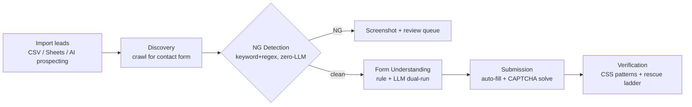
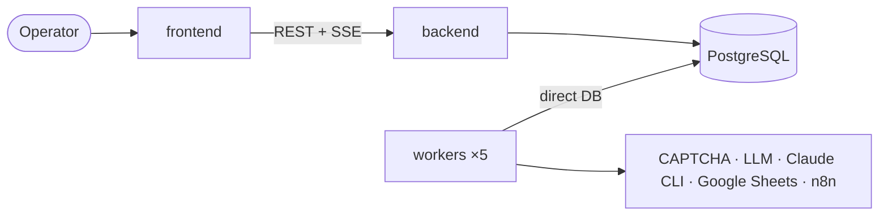

# Project Overview — `tool_sales`

> Sales Automation Tool — a Japanese B2B sales-form automation pipeline. Generated by the Document Project workflow (deep scan, 2026-06-20).

## 1. What It Is

`tool_sales` automates high-volume B2B outreach to the **Japanese market** through website contact forms. It replaces a manual operation that needed **30 staff** with an automated pipeline run by **~5 operators**, sustaining **~12,000 form submissions/day**. It is a modern, fully-owned rebuild of a reference tool (`sales-tool.vinasaver.vn`) on a Next.js + FastAPI + Playwright stack.

It is **not a SaaS product**. Every decision optimizes for one team, one market (Japan), one workflow. No multi-tenant, no public portal, no mobile.

## 2. The Defining Feature — NG Detection

Many Japanese sites explicitly prohibit commercial solicitation (e.g. "営業お断り", references to 特定商取引法). Submitting to these "NG" sites can incur **real fines**. NG Detection is therefore a **legal safeguard, not a feature**:

- **Function-based, ZERO LLM** — Japanese keyword exact-match + regex + false-positive filters (ported from `scrape_ng3.py`). Sub-millisecond, zero API cost.
- **Mandatory pipeline gate** — no code path reaches Submission without passing NG screening.
- **Immutable audit trail** — matched method/pattern/snippet recorded and never mutated (legal record), with screenshot evidence and a non-blocking human review queue.
- Safe-by-default: a suspected NG page halts that lead; false positives only delay, never risk a fine. Target: **<1% false negatives** (the most critical metric).

## 3. The Pipeline

## 4. Architecture at a Glance

A **monorepo with three deployable parts** plus an observability stack, all over one PostgreSQL database.

| Part | Stack | Role |
|------|-------|------|
| [`frontend/`](./architecture-frontend.md) | Next.js 16, React 19, TanStack Query, Zustand, shadcn/ui | Operator dashboard (REST + SSE) |
| [`backend/`](./architecture-backend.md) | FastAPI, SQLAlchemy 2.0 async, Alembic, Pydantic v2 | API, auth, job queue, KPI, SSE |
| [`workers/`](./architecture-workers.md) | Python 3.12, Playwright Chromium | Discovery, form understanding, submission, prospecting + reaper |

**Defining decision:** workers communicate with the backend via **direct database updates — no REST callback layer**. The backend reads job state from the DB and pushes changes to the frontend over SSE.

## 5. Tech Stack Summary

| Layer | Technology |
|-------|-----------|
| Frontend | Next.js 16.2, React 19.2, TypeScript 5, Tailwind v4, shadcn/ui, TanStack Query 5, Zustand 5, React Hook Form + Zod, Vitest |
| Backend | Python 3.12, FastAPI, SQLAlchemy 2.0 async + asyncpg, Alembic, Pydantic v2, PyJWT + bcrypt, pytest |
| Workers | Python 3.12, Playwright (Chromium), BeautifulSoup4 + lxml, asyncpg, pytest |
| Data/Infra | PostgreSQL 16 (materialized views, WAL archiving/PITR), Docker Compose (13 services), GitHub Actions CI |
| Observability | Grafana + Loki + Promtail (structured JSON logs to stdout) |
| External | LLM API (form understanding only), CAPTCHA solvers (2captcha/anti_captcha/capsolver), Google Sheets, n8n, Claude CLI (prospecting) |

## 6. Scope & Status

**Implemented:** 7 epics / 38 stories — Auth & RBAC, Dashboard, Leads (CSV/Sheets import, CRUD, status workflow), Our Information + placeholders, Campaigns (lifecycle, rate limits, retry), Discovery + NG Detection (+ screenshot + review), Form Understanding (dual-run, tiered LLM breaker, graduation, CAPTCHA detection), Submission (auto-fill, CAPTCHA hand-off, checkpoint), Verification (CSS + rescue ladder), Anti-Bot config, Workers (monitoring + n8n webhooks), Prospecting (AI crawl/scrape/enrich), Basic KPI.

**Deferred to Phase 2:** Email outreach (M365 Graph), response tracking/nurturing, advanced analytics, automated scheduler, dedicated review queues, time-tracking KPI, Slack notifications, proxy rotation, automated backups, full audit log.

**Success metrics:** ~12,000 submissions/day with 5 operators · **<1% NG false negatives** (critical) · ≥80% submission success · operator productive within 1 day · >99% uptime in JST business hours.

## 7. Documentation Map

| Document | Covers |
|----------|--------|
| [Source Tree Analysis](./source-tree-analysis.md) | Annotated repo layout |
| [Frontend Architecture](./architecture-frontend.md) · [Component Inventory](./component-inventory-frontend.md) | Dashboard internals |
| [Backend Architecture](./architecture-backend.md) · [API Contracts](./api-contracts-backend.md) · [Data Models](./data-models-backend.md) | API server |
| [Workers Architecture](./architecture-workers.md) | Automation fleet |
| [Integration Architecture](./integration-architecture.md) | How parts connect |
| [Deployment Guide](./deployment-guide.md) · [Development Guide](./development-guide.md) | Run & operate |

> Source of truth for design intent: `_bmad-output/planning-artifacts/architecture/`. AI-agent rule sheet: `_bmad-output/project-context.md`.
